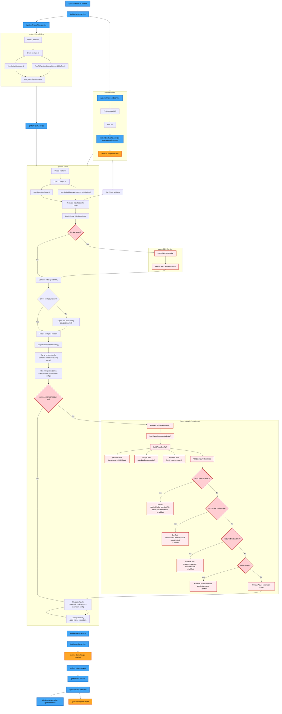

```mermaid
flowchart TB
    %% ===== IGNITION BOOT FLOW =====
    
    %% --- Early Boot ---
    setup_pre["ignition-setup-pre.service"] --> setup["ignition-setup.service"]
    setup --> fetch_offline["ignition-fetch-offline.service"]
    
    %% --- Fetch Offline Details ---
    subgraph FETCH_OFFLINE ["Ignition Fetch Offline"]
        direction TB
        offline_detect_platform["Detect platform"]
        offline_check_configs["Check configs at:"]
        offline_base_dir["/usr/lib/ignition/base.d"]
        offline_platform_dir["/usr/lib/ignition/base.platform.d/{platform}"]
        offline_detect_platform --> offline_check_configs
        offline_check_configs --> offline_base_dir
        offline_check_configs --> offline_platform_dir
        offline_merge_configs["Merge configs if present"]
        offline_base_dir --> offline_merge_configs
        offline_platform_dir --> offline_merge_configs
    end
    fetch_offline --> FETCH_OFFLINE
    
    FETCH_OFFLINE --> fetch_service["ignition-fetch.service"]
    
    %% --- Fetch Service Details ---
    subgraph FETCH_ONLINE ["Ignition Fetch"]
        direction TB
        online_detect_platform["Detect platform"]
        online_check_configs["Check configs at:"]
        online_base_dir["/usr/lib/ignition/base.d"]
        online_platform_dir["/usr/lib/ignition/base.platform.d/{platform}"]
        online_detect_platform --> online_check_configs
        online_check_configs --> online_base_dir
        online_check_configs --> online_platform_dir

        online_request_cloud_configs["Request cloud specific configs"]
        imds_userdata["Fetch Azure IMDS userData"]

        %% PPS gate is its OWN step after IMDS userData, always evaluated
        pps_enabled{"PPS enabled?"}
        fetch_continue["Continue fetch (post-PPS)"]

        online_cloud_configs_present{"Cloud configs present?"}
        online_use_cloud_configs["Merge configs if present"]
        online_open_config_device["Open and read config device (/dev/sr0)"]

        %% Provider config pipeline inside fetch
        fetch_provider["Engine.fetchProviderConfig()"]
        parse_config["Parse ignition.config<br/>(schema validation during parse)"]
        render_config["Render ignition.config<br/>(merge/replace referenced configs)"]

        azure_knob{"ignition.extensions.azure set?"}
        merge_in_fetch["Merge in Fetch:<br/>rendered config + azure extension config"]
        post_merge_validate["Config.Validate()<br/>(post-merge validation)"]

        online_base_dir --> online_request_cloud_configs
        online_platform_dir --> online_request_cloud_configs

        %% Get IMDS userData first
        online_request_cloud_configs --> imds_userdata --> pps_enabled

        %% PPS decision: either run PPS (external) or skip, then rejoin ONE path
        pps_enabled -->|No| fetch_continue
        %% Yes path goes out to PPS service (wired below) and returns to fetch_continue

        %% Now do the normal cloud-config decision AFTER PPS gate completes
        fetch_continue --> online_cloud_configs_present
        online_cloud_configs_present -->|Yes| online_use_cloud_configs
        online_cloud_configs_present -->|No| online_open_config_device
        online_open_config_device --> online_use_cloud_configs

        %% After base config is assembled, run provider pipeline
        online_use_cloud_configs --> fetch_provider --> parse_config --> render_config --> azure_knob

        %% If knob is not set, proceed directly to merge+validate (azure ext config is empty/no-op)
        azure_knob -->|No| merge_in_fetch --> post_merge_validate
    end
    fetch_service --> FETCH_ONLINE
    
    %% --- Network Stack ---
    subgraph NETWORK ["Network Stack"]
        direction TB
        networkd_service["systemd-networkd.service"]
        find_primary_nic["Find primary NIC"]
        link_up["Link up"]
        network_config["systemd-networkd.service - Network Configuration"]
        network_target["network.target reached"]
        networkd_service --> find_primary_nic --> link_up --> network_config --> network_target
    end
    setup --> NETWORK
    NETWORK --> FETCH_ONLINE
    NETWORK --> get_dhcp_address["Get DHCP address"]
    get_dhcp_address --> online_request_cloud_configs
    
    %% --- Azure PPS side-flow (separate) ---
    subgraph AZURE_PPS ["Azure PPS Service"]
        direction TB
        pps_service["azure-init-pps.service"]
        pps_output["Output: PPS artifacts / state"]
        pps_service --> pps_output
    end

    %% Branch out ONLY from PPS enabled=Yes, then return to the single rejoin point
    pps_enabled -->|Yes| pps_service
    pps_output --> fetch_continue

    %% --- Extensions side-flow (separate) ---
    subgraph APPLY_EXTENSIONS ["Platform.ApplyExtensions()"]
        direction TB
        apply_ext["Platform.ApplyExtensions()"]
        fetch_prov_data["fetchAzureProvisioningData()"]
        build_azure_cfg["buildAzureConfig()"]
        azure_users["passwd.users<br/>(admin user + SSH keys)"]
        azure_files["storage.files<br/>(sshd/sudoers drop-ins)"]
        azure_units["systemd.units<br/>(mnt-resource.mount)"]

        validate_conflicts["ValidateAzureConflicts()"]
        sshd_enabled{"sshdDropInEnabled?"}
        sshd_conflict["Conflict: /etc/ssh/sshd_config.d/50-azure-cloud-sshd.conf<br/>→ fail-fast"]
        sudoers_enabled{"sudoersDropInEnabled?"}
        sudoers_conflict["Conflict: /etc/sudoers.d/azure-cloud-sudoers.conf<br/>→ fail-fast"]
        rd_enabled{"resourceDiskEnabled?"}
        rd_conflict["Conflict: mnt-resource.mount or /mnt/resource<br/>→ fail-fast"]
        user_enabled{"userEnabled?"}
        user_conflict["Conflict: Azure osProfile adminUsername<br/>→ fail-fast"]

        azure_ext_out["Output: Azure extension config"]

        apply_ext --> fetch_prov_data --> build_azure_cfg
        build_azure_cfg --> azure_users
        build_azure_cfg --> azure_files
        build_azure_cfg --> azure_units

        build_azure_cfg --> validate_conflicts
        validate_conflicts --> sshd_enabled
        sshd_enabled -->|Yes| sshd_conflict
        sshd_enabled -->|No| sudoers_enabled
        sudoers_enabled -->|Yes| sudoers_conflict
        sudoers_enabled -->|No| rd_enabled
        rd_enabled -->|Yes| rd_conflict
        rd_enabled -->|No| user_enabled
        user_enabled -->|Yes| user_conflict
        user_enabled -->|No| azure_ext_out
    end

    %% Branch out to ApplyExtensions if knob enabled, then return to Fetch merge
    azure_knob -->|Yes| apply_ext
    azure_ext_out --> merge_in_fetch
    merge_in_fetch --> post_merge_validate

    %% --- Disk & Mount Services ---
    post_merge_validate --> kargs_service["ignition-kargs.service"]
    kargs_service --> disks_service["ignition-disks.service"]
    disks_service --> diskful_target["ignition-diskful.target reached"]
    diskful_target --> mount_service["ignition-mount.service"]
    
    %% --- Files & Users ---
    mount_service --> files_service["ignition-files.service"]
    files_service --> quench_service["ignition-quench.service"]
    quench_service --> initrd_setup_root["initrd-setup-root-after-ignition.service"]
    quench_service --> complete_target["ignition-complete.target"]
    
    %% ===== STYLING =====
    classDef service fill:#42a5f5,stroke:#1565c0,stroke-width:2px,color:#000
    classDef target fill:#ffa726,stroke:#e65100,stroke-width:2px,color:#000

    %% Red styling for Azure side-flows
    classDef azureRed fill:#ffebee,stroke:#c62828,stroke-width:2px,color:#000
    classDef azureRedDecision fill:#ffcdd2,stroke:#b71c1c,stroke-width:2px,color:#000

    class setup_pre,setup,fetch_offline,fetch_service,kargs_service,disks_service,mount_service,files_service,quench_service,initrd_setup_root,network_config,networkd_service service
    class diskful_target,complete_target,network_target target

    %% PPS in red
    class pps_service,pps_output azureRed
    class pps_enabled azureRedDecision

    %% ApplyExtensions in red
    class apply_ext,fetch_prov_data,build_azure_cfg,azure_users,azure_files,azure_units,validate_conflicts,sshd_conflict,sudoers_conflict,rd_conflict,user_conflict,azure_ext_out azureRed
    class sshd_enabled,sudoers_enabled,rd_enabled,user_enabled azureRedDecision
    class azure_knob azureRedDecision
```